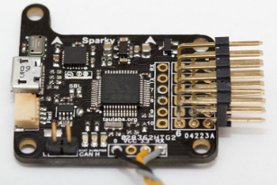
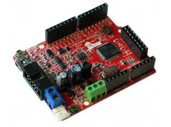

# NinjaFlight

An even cleaner version of cleanflight flight-controller - flight controllers
are used to fly multi-rotor craft and fixed wing craft. 

Latest release: 1.16.10 (Codename: "Panic In The Sewers")

This fork differs from cleanflight in that it attempts to use modern software
development practices which result in:

- Greater reliability through code robustness and automated testing. 
- Easier maintenance through code cleanliness.
- Easier to develop new features. 
- Easier to re-use code through code de-coupling and modularisation.
- Code coverage driven unit test design that results in more exhaustive unit
  tests that are more exhaustive than before.

Even though cleanflight project cleaned up a lot of the horrible mess of
MultiWii software, it still fails to live up to a lot of good coding practices
that are present in high quality C code. This project aims to clean things up
even further by: 

- eliminating all "extern" variables in C files
- objectifying everything into structs and methods that operate on specific
  sets of objects. Thus improving data flow by eliminating global data as much
  as possible.
- making the code reentrant (using global variables kills reentrancy more than
  anything else)
- separating things even more so that we can simulate the flight control
  software on desktop as we develop it. 
- test as many lines of code as possible by making code coverage standard step
  in developing unit tests. 

At all times we will try to keep the software in fully functional state while
introducing these changes.  

## Features

- Multi-color RGB LED strip support (each LED can be a different color using
  variable length WS2811 addressable RGB strips - use for orientation
  indicators, low battery warning, flight mode status, etc.).
- Oneshot ESC support.
- Blackbox flight recorder logging (to onboard flash or external SD card).
- Support for additional targets that use the STM32F3 processors (baseflight
  only supports STM32F1).
- Support for the Seriously Pro Racing F3 board (STM32F303, I2C sensors, large
  flash, excellent I/O.).
- Support for the TauLabs Sparky board (STM32F303, I2C sensors, based board
  with acc/gyro/compass and baro, ~$35).
- Support for the OpenPilot CC3D board (STM32F103, board, SPI acc/gyro, ~$20).
- Support for the CJMCU nano quadcopter board.
- Support for developer breakout boards: (Port103R, EUSTM32F103RC, Olimexino,
  STM32F3Discovery).
- Support for more than 8 RC channels - (e.g. 16 Channels via FrSky X4RSB
  SBus).
- Support for N-Position switches via flexible channel ranges - not just 3 like
  baseflight or 3/6 in MultiWii.
- Lux's new PID (uses float values internally, resistant to looptime
  variation).
- Simultaneous Bluetooth configuration and OSD.
- Better PWM and PPM input and failsafe detection than baseflight.
- Better FrSky Telemetry than baseflight.
- LTM Telemetry.
- Smartport Telemetry.
- RSSI via ADC - Uses ADC to read PWM RSSI signals, tested with FrSky D4R-II
  and X8R.
- OLED Displays - Display information on: Battery voltage, profile, rate
  profile, version, sensors, RC, etc.
- In-flight manual PID tuning and rate adjustment.
- Rate profiles and in-flight selection of them.
- Graupner PPM failsafe.
- Graupner HoTT telemetry.
- Multiple simultaneous telemetry providers.
- Configurable serial ports for Serial RX, Telemetry, MSP, GPS - Use most
  devices on any port, softserial too.
- And many more minor bug fixes.

Ninjaflight also supports: 

- Tilted propeller racing drones with dynamic and static tilting. Throttle
  compensation and yaw/roll compensation is also supported. 

## Most popular supported boards

*NAZE*

*CJMCU*

*CC3D*

*DODO*

*Sparky*

*SPRacingEVO*

*SPRacingF3*

*Colibri Race*

*Lux Race*

*Olimexino*

## Installation

See: [Installation.md](docs/Installation.md)

## Documentation

See: [docs folder](https://github.com/mkschreder/ninjaflight/tree/master/docs)

If what you need is not covered, check the [Cleanflight
documentation](https://github.com/cleanflight/cleanflight/tree/master/docs). 

In many ways currently ninjaflight works exactly like cleanflight so a lot of
things are already covered by cleanflight documentation (although this may
change as the project evolves).  

## Configuration Tool

To configure Ninjaflight you can use the [Cleanflight-configurator GUI tool](https://chrome.google.com/webstore/detail/cleanflight-configurator/enacoimjcgeinfnnnpajinjgmkahmfgb
) (Windows/OSX/Linux). 

The source for it is here:

https://github.com/cleanflight/cleanflight-configurator

## Contributing

Contributions are welcome and encouraged.  You can contribute in many ways:

- Documentation updates and corrections.
- How-To guides - Received help? Help others!
- Bug fixes.
- New features.
- Telling us your ideas and suggestions.

The best place to start is the IRC channel on freenode (see above), drop in, say hi. Next place is the github issue tracker:

https://github.com/mkschreder/ninjaflight/issues

And also: 

https://github.com/mkschreder/ninjaflight/issues
https://github.com/cleanflight/cleanflight-configurator/issues

Before creating new issues please check to see if there is an existing one,
search first otherwise you waste peoples time when they could be coding
instead!

See [CONTRIBUTING.md](CONTRIBUTING.md)

## Acknowlegements

Every single person who has contributed to this project over time (see AUTHORS
file). 

